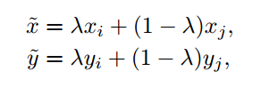
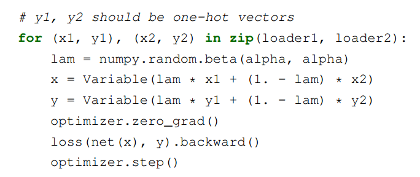
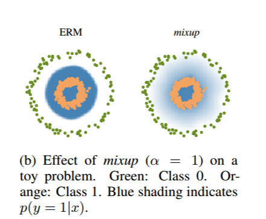
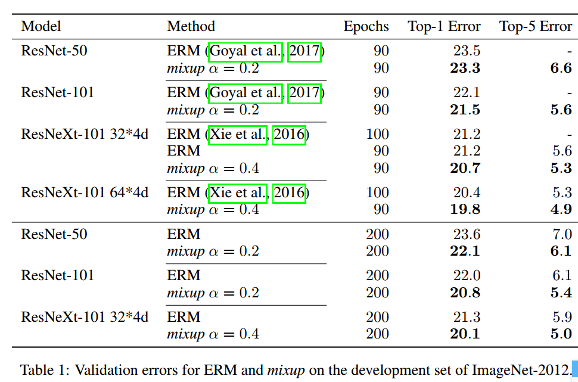

## 2018-12-8 ~ 2018-12-19

###  **实验** 

**实验意图与方向**：通过图像风格转换机制尝试对不同风格的甲状腺超声图像进行转换，在转换后进行特征的对齐

**实验结果**：使用cycleGan训练10000轮后，部分图像转换效果一般，部分存在雪花、亮点等不清晰的地方

### **论文阅读**
**题目**：mixup: BEYOND EMPIRICAL RISK MINIMIZATION

**出处** ：ICLR2018

**作者**：Hongyi Zhang(MIT) Moustapha Cisse, Yann N. Dauphin, David Lopez-Paz(FAIR)

**背景**:深度神经网络存在两个个共性的特点
1. 对于训练数据取最小平均错误（经验风险最小化）
2. 优秀的神经网络规模与训练样本数目呈线性关系
然而，经典机器学习理论告诉我们，只要学习机（如神经网络）的规模不随着训练数据数量的增加而增加，那么ERM的收敛性就是可以得到保证的。其中，学习机的规模由参数数量来衡量。 
1. 即使在强正则化情况下，或是在标签随机分配的分类问题中，ERM 也允许大规模神经网络去记忆（而不是泛化）训练数据。
2. 神经网络使用ERM 方法训练后，在训练分布之外的样本（对抗样本）上验证时会极大地改变预测结果。
同时，在测试分布与训练数据略有不同时，ERM 方法也不具有良好的解释和泛化性能。因此，我们需要数据增强来提高泛化性能。
**贡献**：作者提出了一种简单且数据无关的数据增强方式，被称作 mixup 。

mixup通过结合原始数据，使用特征向量的线性插值导致相关标签的线性插值，来扩展训练分布。

**个人理解**：mixup领域分布可以看作一种的数据增强方式用来增强了模型在训练样本之间的线性表现。因此，它可以很好地对抗噪声样本

上图显示了mixup 在类与类之间提供了更平滑的过渡线来估计不确定性。

上图显示了两个神经网络（using ERM and mixup）在训练CIFAR-10 数据集上的平均表现。两个模型有着同样的结构，使用同样的步骤训练，在同样的训练数据中采样相同的点进行评估。使用mixup训练的模型在训练样本之间的模型预测和梯度模值更加稳定。

**实验效果**

