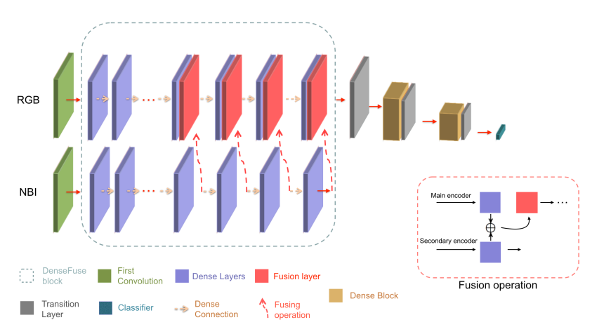
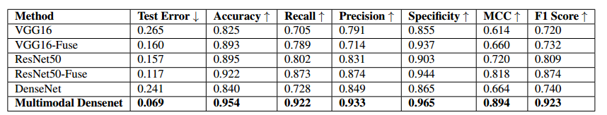
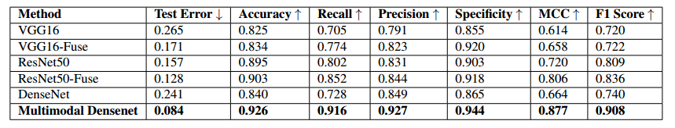
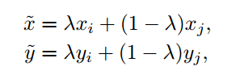
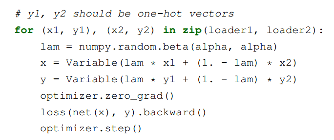
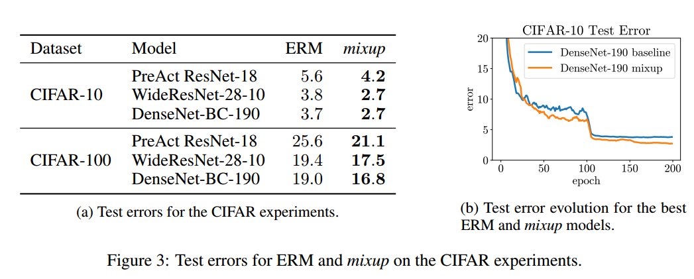
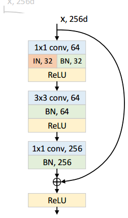
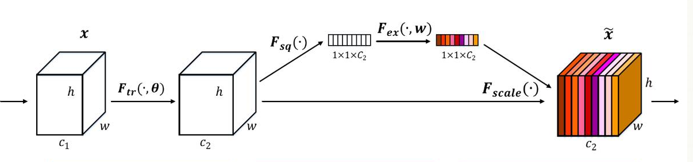
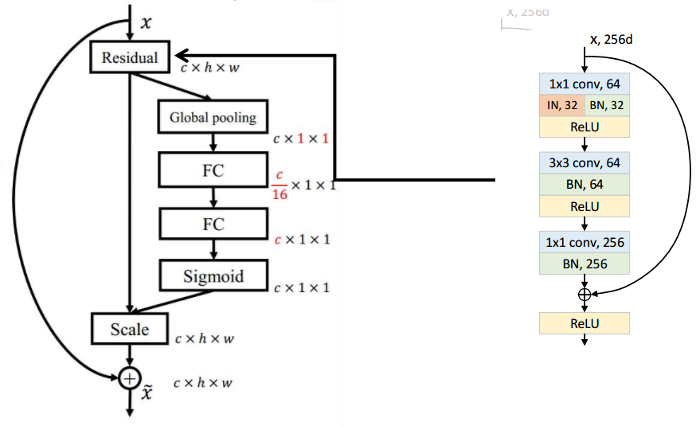

## 2018-12-1 ~ 2018-12-7

###  **实验** 

**实验意图与方向**：复现对抗判别网络ADDA(Adversarial Discriminative Domain Adaptation)(https://arxiv.org/abs/1809.03625)

**实验结果**:对抗训练的时候网络没有学到想要的东西
训练集：philips数据集 测试集：toshiba

| 模型 | 真阳性 | 真阴性 |
|:------:|:------:|:------:|
|LeNet|77.5%|68.2%|
|ADDA-LeNet|3.8%| 96.3%|
### **论文阅读**
**题目**：Multimodal Densenet

**出处**：arxiv

**作者**：Faisal Mahmood, Ziyun Yang, Thomas Ashley and Nicholas J. Durr

**背景**在医学图像处理，数据常常是多模态的，诊断检查可能依赖于来自病人病史、体格检查、器官水平医学成像、组织学分析和实验室研究的信息。即使是单纯的图像信息，多模态的图像信息也有助于提高检出率。

**数据集**：
ISIT-UMR Multimodal Polyp Classification Dataset：数据集包括3类息肉:15种锯齿状腺瘤，21种增生性病变，40种腺瘤，共76例。

Kvasir Landmark and Pathological ClassificationDataset.：数据集共7类，3类为标志物检测(z线、幽门、盲肠)，3类为病理发现(食管炎、息肉和溃疡性结肠炎)，1类为正常结肠黏膜。每个类使用了1000个图像，总共使用了7000个图像。

**网络结构**：

上图中网络输入分为两部分，一部分是RGB信息，另一部分是NBI信息，对于没有NBI信息的数据集，使用风格转换网络将RGB信息转换成NBI

**实验结果**：
数据集：深度信息+RGB

数据集：NBI+RGB

## 2018-12-8 ~ 2018-12-19

###  **实验** 

**实验意图与方向**：通过图像风格转换机制尝试对不同风格的甲状腺超声图像进行转换，在转换后进行特征的对齐

**实验结果**：使用cycleGan训练10000轮后，部分图像转换效果一般，部分存在雪花、亮点等不清晰的地方

### **论文阅读**
**题目**：mixup: BEYOND EMPIRICAL RISK MINIMIZATION

**出处** ：ICLR2018

**作者**：Hongyi Zhang(MIT) Moustapha Cisse, Yann N. Dauphin, David Lopez-Paz(FAIR)

**背景**:深度神经网络存在两个个共性的特点
1. 对于训练数据取最小平均错误（经验风险最小化）
2. 优秀的神经网络规模与训练样本数目呈线性关系
然而，经典机器学习理论告诉我们，只要学习机（如神经网络）的规模不随着训练数据数量的增加而增加，那么ERM的收敛性就是可以得到保证的。其中，学习机的规模由参数数量来衡量。 
1. 即使在强正则化情况下，或是在标签随机分配的分类问题中，ERM 也允许大规模神经网络去记忆（而不是泛化）训练数据。
2. 神经网络使用ERM 方法训练后，在训练分布之外的样本（对抗样本）上验证时会极大地改变预测结果。
同时，在测试分布与训练数据略有不同时，ERM 方法也不具有良好的解释和泛化性能。因此，我们需要数据增强来提高泛化性能。
**贡献**：作者提出了一种简单且数据无关的数据增强方式，被称作 mixup 。

mixup通过结合原始数据，使用特征向量的线性插值导致相关标签的线性插值，来扩展训练分布。

**个人理解**：mixup领域分布可以看作一种的数据增强方式用来增强了模型在训练样本之间的线性表现。因此，它可以很好地对抗噪声样本

上图显示了mixup 在类与类之间提供了更平滑的过渡线来估计不确定性。

上图显示了两个神经网络（using ERM and mixup）在训练CIFAR-10 数据集上的平均表现。两个模型有着同样的结构，使用同样的步骤训练，在同样的训练数据中采样相同的点进行评估。使用mixup训练的模型在训练样本之间的模型预测和梯度模值更加稳定。

**实验效果**

## 2018-12-20 ~ 2018-12-26
###  **实验**
**实验意图与方向**：重新看了下之前的IBN-Net和SENet，思考下觉得是否可以联系在一起
***IBN-Net***：
IBN-Net在网络中添加了Instance Normalization，Instance Normalization一般应用与风格迁移网络中，它可以提升网络对于风格变化的鲁棒性。
IBN-Net结构如图所示：

网络在ResNet的残差块中，将第一层1\times1卷积层之后的BN操作改为一半通道使用BN，一半通道使用IN。
***SE-Net***：
SE-Net使用SE模块考虑网络特征通道之间的关系。SE模块结构如下图所示：

首先是 Squeeze 操作，对于一个通道数为c_2的特征，SE模块顺着空间维度来进行特征压缩，将每个二维的特征通道变成一个实数，这个数代表每个通道的全局感受野。
然后是 Excitation 操作，为每个特征通道生成权重，然后通过乘法逐通道加权到先前的特征上。

**实验效果**：
网络模型结构如图：

| 模型 | 准确率 | 
|:------:|:------:|
|ResNet|92.5%|
|IBN-net|93.5%|
|SE-IBN-net|96.7%|

